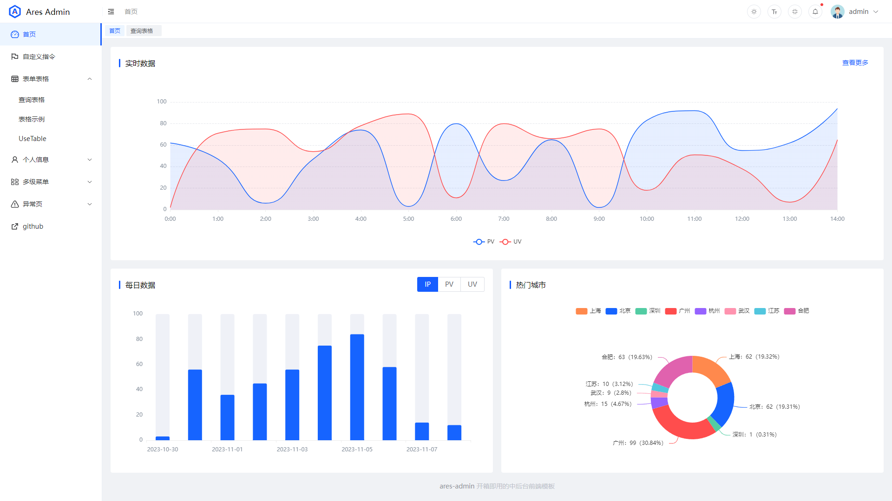
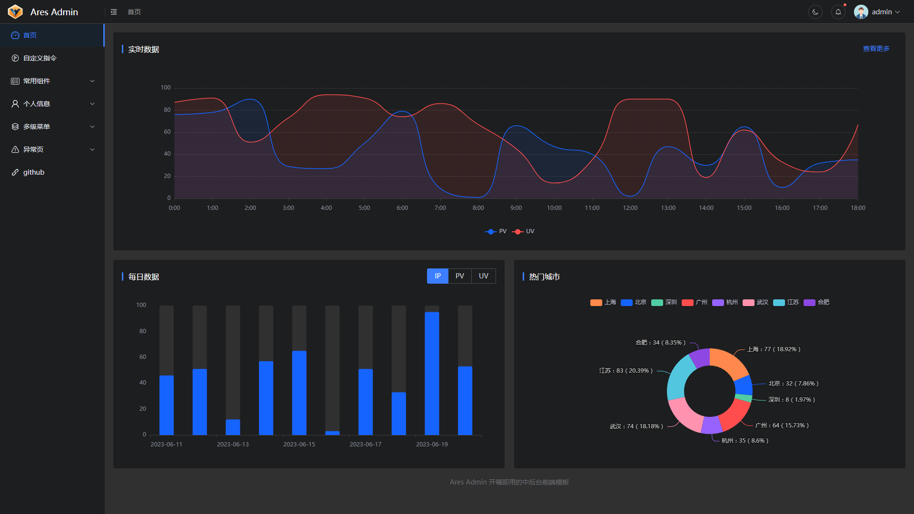
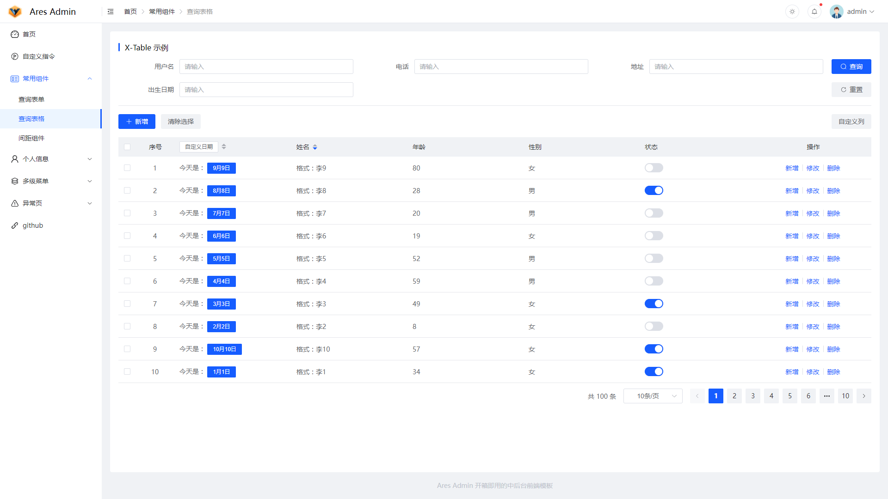

<div align="center">


<h1>Ares Admin</h1>

[](https://github.com/zhangsanplus/ares-admin/blob/main/LICENSE)

基于 Element Plus 和 Vue3 的开箱即用的中后台前端模板
</div>

## 🔥 Overview

**Ares Admin** 是一个以古希腊神话中战神 Ares 命名的中后台管理系统模板。该模板借鉴了多个优秀的开源项目，并对一些常用功能进行封装，帮助用户在工作中能够快速地搭建各种中后台项目，让开发变得更加简单和高效。

无论你是刚开始学习中后台开发，还是已经有一定经验的开发者，Ares Admin 都能帮助你快速构建出令人满意的管理系统。

## 🚀 Preview

在线预览 [Ares Admin](https://zhangsanplus.github.io/)





## ✨ Features

- **Vue3** - 使用最新的 Vue3 和组合式 API
- **Element Plus** - 轻便高效的 Element UI
- **TypeScript** - 应用程序级 JavaScript 的语言
- **Vite** - 快速启动的 Vite
- **Pinia** - 新一代 Vue.js 状态管理库
- **Vueuse**  -  实用的Vue组合式API工具集
- **ESLint** - 代码检查
- **Stylelint** - CSS 格式化
- **LsLint** - 文件命名检查

## 🌈 Usage

- 安装依赖

```bash
pnpm i
```

- 开发运行

```bash
npm run dev
```

- 编译构建

```bash
# 测试环境
npm run build:staging

# 生产环境
npm run build
```

## 🍧 Contribution

- 参考 [vue](https://github.com/vuejs/vue/blob/dev/.github/COMMIT_CONVENTION.md) 规范 ([Angular](https://github.com/conventional-changelog/conventional-changelog/tree/master/packages/conventional-changelog-angular))

  - `feat` 增加新功能
  - `fix` 修复问题/BUG
  - `style` 代码风格相关无影响运行结果的
  - `perf` 优化/性能提升
  - `refactor` 重构
  - `revert` 撤销修改
  - `test` 测试相关
  - `docs` 文档/注释
  - `chore` 依赖更新/脚手架配置修改等
  - `workflow` 工作流改进
  - `ci` 持续集成
  - `types` 类型定义文件更改
  - `wip` 开发中
